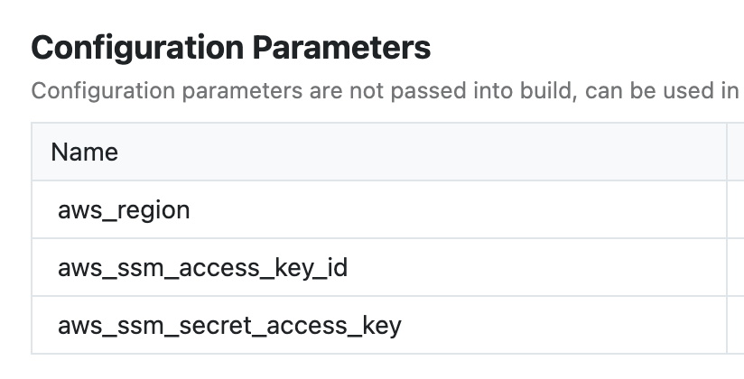
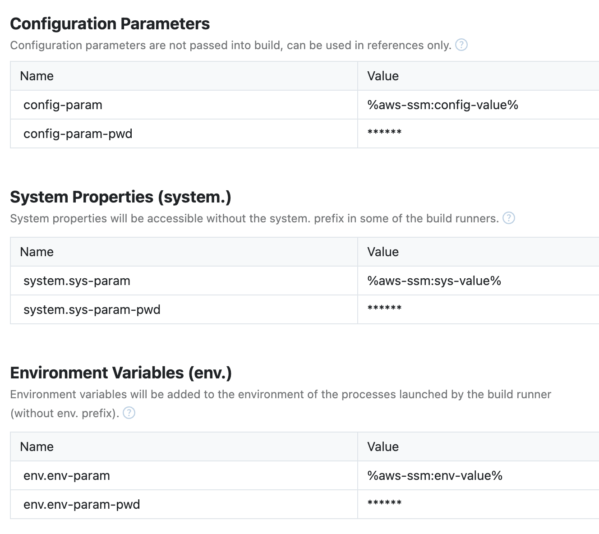
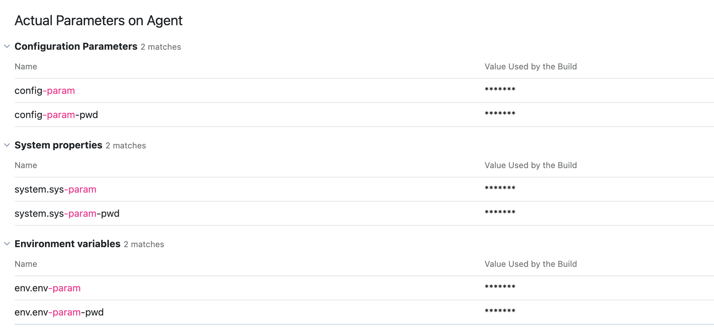

# TeamCity AWS SSM Plugin

This TeamCity AWS SSM parameter plugin dynamically retrieves the value of TeamCity parameters (Configuration Parameters, System Properties, and Environment Variables), whose values are in the format of `%aws-ssm:<secret-name>%` from AWS Parameter Store and update the value of the parameters to the actual values in `password` type of the build.

## Build the plugin

```shell
./gradlew build
```
It will generate the plugin zip file: `build/distributions/teamcity-aws-ssm-plugin.zip`.

- Within the `teamcity-aws-ssm-plugin.zip` file, it has the following structure:

```shell
.
├── agent
│   └── agent-0.1.0.zip
├── server
│   └── teamcity-aws-ssm-plugin-0.1.0.jar
└── teamcity-plugin.xml
```

- Within the `agent-0.1.0.zip`, it has the following structure:

```shell
.
├── lib
└── teamcity-plugin.xml
```

## Use the plugin

### Prerequisites

1. Make sure an AWS user has the permission to get SSM parameters (`ssm:GetParameter`).
2. Set up following configuration parameters in the TeamCity project to have the connection with AWS:
    1. `aws_region`
    2. `aws_ssm_access_key_id`
    3. `aws_ssm_secret_access_key`

   
3. Have a TeamCity user with system administrator role.


### Usage

1. Upload the plugin zip to TeamCity `Plugins` section. This requires the user has the system administrator role.
2. In the TeamCity project, create any Configuration Parameters, System Properties, or Environment Variables as needed.
    1. Their values need to be in the format of `%aws-ssm:<secret-name>%`.
    2. In the AWS Parameter Store, there should be secrets with the name `<secret-name>`.

### Example

Add these parameters into the TeamCity project:


In the TeamCity build,
`Detected ssm parameters: [system.sys-param, env.env-param-pwd, system.sys-param-pwd, config-param-pwd, env.env-param, config-param]`

The plugin will replace all `%aws-ssm:<secret-name>%` with the actual values from the AWS Parameter Store. Also, these values will be in the `password` type without revealing in the UI.


